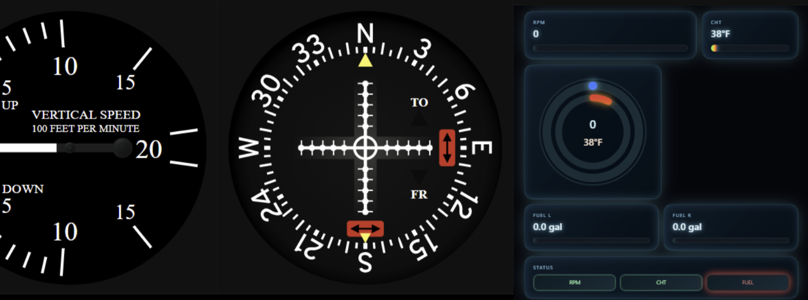

# FlightGear Examples Repository

Welcome! This repository contains small, focused examples and experiments related to the open‑source flight simulator **[FlightGear](https://www.flightgear.org/)**. It currently centers on a WebPanel / browser-based instrumentation prototype and includes the original FlightGear c172p web panel assets alongside an extended "Glass Instrument" example. The examples are for reference and learning—feel free to adapt or extend them for your own FlightGear projects. These examples are not official FlightGear releases.

## 🚀 What’s Here

| Area | Description |
|------|-------------|
| `WebPanel/` | Base directory for all web panel assets and examples. |
| `WebPanel/WebPanel/` | (Name mirrors upstream structure) Contains the original c172p web panel HTML/SVG/JSON resources as published by the FlightGear Project. |
| `WebPanel/GlassInstrument.js` | Core script showcasing a generalized, data‑driven “glass” instrument concept. |
| `WebPanel/GlassInstrumentBuilder.md` | Design/usage notes for building new glass instruments (see below). |

## 🧪 Glass Instrument Example

The Glass Instrument example demonstrates an approach to rendering aircraft panel gauges in the browser using structured JSON plus SVG layers. Instead of hand‑coding every gauge, a builder-style configuration (documented in `WebPanel/GlassInstrumentBuilder.md`) describes:



* Data binding to FlightGear properties (e.g. `/engines/engine[0]/rpm`)
* Value scaling / interpolation (see the included interpolation XML samples)
* HTML element mapping (needles, tapes, textual readouts)
* Update loop & animation smoothing

Because the definition is declarative, you can compose new instruments by editing JSON and SVG assets—minimizing JavaScript changes.

> For full details, read: `WebPanel/GlassInstrumentBuilder.md` (referenced source of truth for the builder pattern, assumptions, and extension points).

## ✈️ Included c172p Web Panel (Upstream Assets)

The directory `WebPanel/WebPanel/` intentionally preserves (with minimal or no modification) the original **c172p** web panel as produced by the FlightGear Project. These assets are provided here solely for educational and interoperability purposes—allowing side‑by‑side experimentation with enhanced / glass-style instruments.

Please refer to the official FlightGear project for authoritative, current versions: https://www.flightgear.org/

## 🔧 Getting Started


1. Copy the `c172p-webpanel.html` file into you FlightGear data folder for the c172p. E.g. 

    ```
    C:\Users\<user name>\FlightGear\Downloads\fgdata_2024_1\Aircraft\c172p\WebPanel
    ```

1. Connect it to a running FlightGear instance 
    ```shell
    "C:\Program Files\FlightGear 2024.1\bin\fgfs.exe" --aircraft=c172p --httpd=8080 --console --enable-developer
    ```
1. Inspect `GlassInstrument.js` definitions; try cloning it to create your own custom instrument.
1. Include a reference to you new instrument in `c172p-webpanel.html`.


## 🤝 Contributing

Feel free to open issues or submit PRs with:
* Additional sample instruments
* Performance or rendering improvements
* Documentation clarifications

## 📜 License

This repository’s original example code is released under the MIT License (see `LICENSE`). Upstream FlightGear-derived assets may be subject to their original licensing—please verify before redistributing outside of an educational or development context.

## 🙏 Acknowledgements

* The **FlightGear Project** and its contributors for the simulator and original c172p web panel resources.
* Open-source communities that make rapid prototyping possible.

---
Questions or ideas? Open an issue—happy to iterate.
